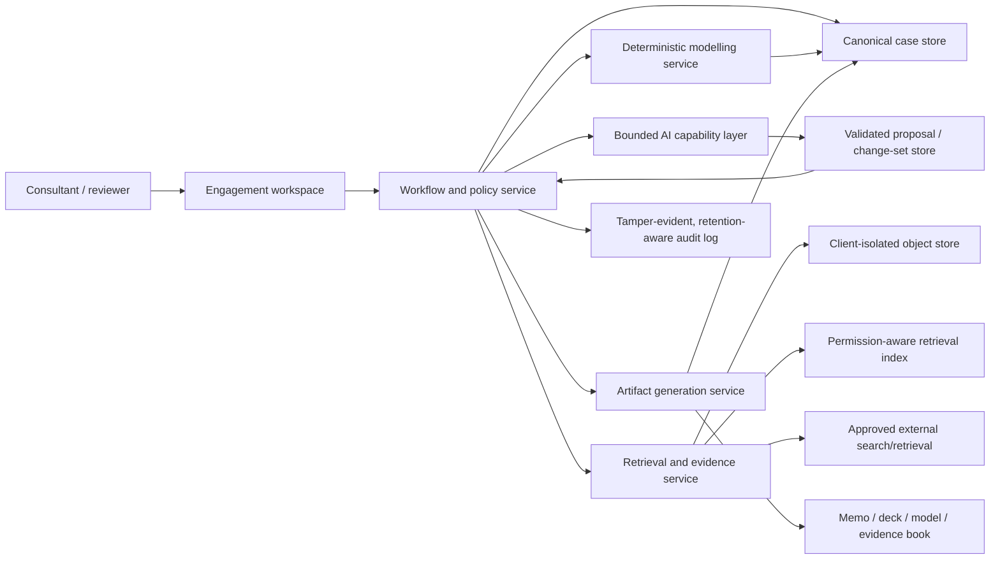
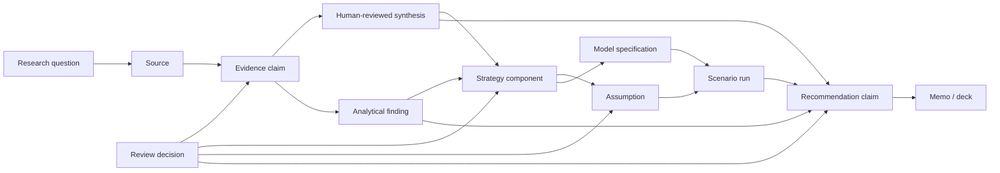

# Conceptual architecture

**Status:** Proposed architecture; implementation decisions remain open  
**Owner:** Engineering / Product  
**Last updated:** 2026-07-11  
**Related:** [PRD](PRD.md) · [Evidence system](EVIDENCE_SYSTEM.md) · [Workflow and oversight](WORKFLOW_AND_OVERSIGHT.md)

## 1. Architectural objective

Implement one controlled engagement system in which probabilistic AI assists interpretation and creation, deterministic services calculate financial effects, rules enforce boundaries, and authorised humans own consequential judgments.

The architecture must preserve lineage across evidence, strategy, model, review and exported assets.

## 2. Design principles

1. **Canonical objects over chat history.** Conversation can edit objects but is not the source of truth.
2. **Probabilistic proposals, deterministic calculations.** LLM output never becomes an authoritative financial result.
3. **Tenant and engagement isolation by construction.** Prompt instructions are not a security boundary.
4. **Human authority is implemented, not described.** Gate transitions require authorised actions.
5. **Every material output is versioned.** Approved versions are immutable and branchable.
6. **Evidence is typed and traceable.** Retrieved facts, client assertions, assumptions, calculations and recommendations are separate objects.
7. **Retrieved content is untrusted.** Files and webpages cannot alter system instructions or permissions.
8. **Start with bounded capabilities.** Do not build an autonomous agent swarm for the MVP.

## 3. High-level architecture



AI output never writes directly to canonical state. It becomes a schema-validated proposal, passes policy checks, and is accepted or rejected by an authorised human through the workflow service.

## 4. Component responsibilities

### 4.1 Engagement workspace

Provides structured views for:

- Decision framing
- Context profile
- Research planning
- Source and evidence review
- Strategy Studio
- Model scenarios
- Recommendation and challenge
- Comments, gates and approvals
- Artifact preview/export

Chat is contextual to the active object. A response proposing a strategy component must be applied as a tracked change before it affects the case.

### 4.2 Workflow and policy service

Owns:

- Engagement states and allowed transitions
- Role-based permissions
- Mandatory fields and stage gates
- Jurisdiction/use-case policy triggers
- Review assignments
- Approval locks and branching
- Tool permissions and action limits

It must not delegate access control or gate decisions to the LLM.

### 4.3 Canonical case store

A relational store is preferred for core state and lineage.

Primary entities:

- Organisation / tenant
- User and role assignment
- Client and engagement
- Decision charter and context profile
- Issue tree, diagnostic hypotheses and pricing-context assessment
- Research question and retrieval run
- Source, source fragment and evidence claim
- Evidence relationship and synthesis
- Analytical finding and method/version
- Strategy, strategy version and component
- Assumption and external input
- Model specification, run, scenario and output
- Recommendation and decision request
- Comment, review, approval and override
- Artifact and artifact version
- Policy version and audit event

### 4.4 Client-isolated object store

Stores original documents, parsed representations and generated artifacts. Objects inherit tenant, engagement, confidentiality, retention and legal-hold metadata.

### 4.5 Retrieval and evidence service

Responsibilities:

- Parse approved files while retaining location metadata
- Execute approved external searches
- Retrieve source content under access and copyright constraints
- Chunk and index content with inherited permissions
- Hybrid retrieve and rerank
- Extract atomic claim candidates
- Cluster duplicates and propose support/conflict relationships
- Validate source/citation resolution
- Propagate source deletion

Retrieval does not approve claims; humans do.

### 4.6 Bounded AI capability layer

Implements named skills with schemas and evaluation, rather than one unconstrained autonomous agent.

Initial capabilities:

| Capability | Purpose | May not do |
|---|---|---|
| Brief interpreter | Draft decision charter and gaps | Approve scope |
| Research planner | Draft questions, queries and source plan | Begin unapproved retrieval |
| Evidence extractor | Propose atomic claims and metadata | Approve evidence |
| Evidence synthesiser | Cluster and propose relationships | Hide conflicts or choose legal conclusion |
| Strategy facilitator | Diverge, combine, challenge and explain | Select final strategy |
| Model-spec assistant | Propose variables and relationships | Execute authoritative arithmetic |
| Recommendation challenger | Produce counter-case and missing tests | Own recommendation |
| Asset composer | Draft memo/deck narrative from approved state | Introduce uncited facts or unmodelled numbers |

Each capability declares:

- Preconditions
- Permitted input object types
- Output schema
- Allowed tools
- Prohibited actions
- Confidence/abstention behaviour
- Required reviewer
- Evaluation cases
- Prompt/workflow version

Capability output is written only to a proposal/change-set store. Schema validation, policy checks and an authorised user action are required before any proposal changes canonical case state.

### 4.7 Deterministic modelling service

Executes approved model specifications and produces reproducible outputs.

Required separation:

```text
Observed client data
+ derived measures
+ approved external inputs
+ approved human assumptions
+ strategy transformations
→ versioned formulas/model
→ scenario outputs
```

The LLM may help map data, propose specifications and explain results; it cannot be the calculation engine.

### 4.8 Artifact generation service

Generates memo, presentation, model export, evidence book and review log from a single case version.

It must:

- Resolve citations to evidence IDs
- Resolve numbers to model-output IDs
- Reuse approved narrative where possible
- Apply template and branding rules
- Run cross-artifact consistency checks
- Embed engagement/version/status metadata
- Mark drafts prominently
- Produce a new artifact version after changes

## 5. Core data model

### 5.1 Typed content model

Every material statement is one of:

| Type | Definition | Approval route |
|---|---|---|
| Retrieved fact | Proposition supported by a source | Evidence reviewer |
| Client assertion | Statement supplied by client/stakeholder but not independently verified | Context owner; remains labelled |
| Analytical finding | Versioned result derived from approved sources/data using a recorded method | Analyst plus relevant reviewer |
| Calculated result | Deterministic output from model/input version | Model owner/reviewer |
| Human assumption | Uncertain input adopted by a named person | Assumption owner and model reviewer |
| AI inference | Machine-generated interpretation or hypothesis | Cannot become evidence without review/source |
| Human interpretation | Expert conclusion drawn from evidence | Strategy/research lead |
| Recommendation | Human-owned proposed course of action | Engagement lead/client owner |
| Generated narrative | Draft wording derived from approved objects | Asset reviewer |

### 5.2 Strategy object

Illustrative schema:

```yaml
strategy:
  id: STRAT-003
  version: 4
  title: "Outcome-linked enterprise offer"
  thesis: "Share measured operational value with enterprise customers"
  status: shortlisted
  authors:
    human: [user-12, user-27]
    ai_contribution: true
  design:
    target_segments: [enterprise]
    offer_and_package: "Managed service with uptime guarantee"
    price_metric: "verified avoided-downtime hour"
    pricing_model: "base subscription plus outcome fee"
    price_architecture: "floor, cap and reconciliation period"
    terms_and_fences: [minimum_term, measurement_protocol]
    migration: "new contracts and voluntary renewals first"
    governance: "pricing committee approval for exceptions"
    pilot: "five customers for two quarters"
  evidence_links:
    supporting: [EV-41, EV-98]
    contrary: [EV-57]
    gaps: [GAP-12]
  assumptions: [ASM-14, ASM-19]
  model_specification: MODEL-7-v3
  dependencies: [billing_change, measurement_audit]
  risks: [customer_dispute, revenue_volatility]
  change_history: []
```

### 5.3 Evidence relationships

Evidence forms a graph even if stored relationally:



## 6. Deterministic modelling approach

### 6.1 MVP model contract

The first model is case-specific to new-offer monetisation; it is not a universal optimiser. For the demonstrator, use one transparent contract covering eligible customers, adoption, connected units, price, variable/service cost, implementation cost, retention where relevant and timing. Strategies that cannot be compared credibly remain qualitatively “not comparable” rather than receiving manufactured precision.

The later product-pilot scenario contract may support:

- Baseline units/customers/contracts
- Current price and realised revenue
- Variable and attributable fixed costs
- Strategy-specific price/metric/package transformations
- Volume/adoption/conversion/retention assumptions where relevant
- Migration timing
- Implementation cost
- Base, downside and upside ranges
- Revenue, gross/contribution margin, customer impact and cash timing outputs

Not every variable applies to every case. Unused variables are explicitly not applicable.

### 6.2 Model extension path

1. **Built-in scenario model:** initial hackathon/pilot case.
2. **Reviewed model adapters:** reusable contracts for common engagement archetypes using allowlisted formulas or a sandboxed model specification.
3. **Client model mapping:** connect approved inputs/outputs from an existing model.
4. **Specialist models:** sector-specific optimisation only after validation.

AI-generated code does not execute as an authoritative model. Any custom extension requires sandboxing, security review, formula/model tests and independent model validation.

### 6.3 Model controls

- Versioned formulas/specification
- Units and currency attached to values
- Data reconciliation report
- Boundary and directional tests
- Scenario reproducibility
- Assumption ownership
- Sensitivity and switching values
- Independent review state
- Numeric-output IDs for artifact insertion

## 7. Retrieval isolation and security

### 7.1 Tenant boundary

- Server-side tenant/engagement authorisation at every object and service boundary: canonical database, object store, retrieval index, proposal store, caches, telemetry/audit, exports, backups, model-provider calls and evaluation datasets
- Query-time and direct-ID authorisation independent of UI filters
- Encryption in transit and at rest
- Embeddings inherit source sensitivity and deletion rules
- No cross-client prompt context, fine-tuning or benchmarking from confidential data
- Adversarial cross-tenant leakage tests

### 7.2 Source deletion

Deleting or expiring a source must cascade to:

- Parsed text and chunks
- Embeddings/index entries
- Cached excerpts
- Unapproved claim candidates
- Evaluation traces containing content
- Regenerable draft artifacts

Approved historical assets may require retention or legal-hold rules; the UI must explain the consequence rather than silently alter them.

### 7.3 Competition-sensitive information

Sources store origin, client, confidentiality and competition-sensitivity. A quarantine path prevents uncertain competitor-confidential material from entering retrieval or generation until documented specialist competition review determines permitted handling.

## 8. Policy and regulatory architecture

Avoid hardcoding prose regulations into prompts. Use versioned policy records containing:

- Jurisdiction and sector
- Applicability conditions
- Effective and review dates
- Authoritative source link
- Required metadata
- Prohibited actions
- Required checks
- Escalation role
- Test cases

MVP policy controls cover:

- Cross-client competition-sensitive information
- B2B/B2C and consumer-price-transparency routing
- Personalised/dynamic pricing classification
- Personal-data and DPIA triggers
- High-risk sector/use-case blocks
- Human approval before external circulation
- Source-use/copyright classification

The policy layer produces flags and workflow gates, not a legal opinion.

Applicable mandatory packs are derived from the engagement profile and activated by the system. Users may confirm or add packs; an ordinary user cannot remove a mandatory pack. Removal or inapplicability requires qualified review and recorded rationale. Precedence is applicable law → authoritative regulatory requirement/guidance as classified → client mandatory policy → firm methodology, with conflicts escalated rather than silently resolved.

## 9. AI and prompt-injection boundaries

External content is data, never instruction. The application should:

- Parse uploads in a sandbox with malware scanning, content-type/size limits and macros/formulas disabled by default
- Sanitise rendered document/web content
- Fetch external content through credential-free allowlisted network paths with SSRF and egress controls
- Keep system/developer policy outside retrieved context
- Mark source boundaries clearly
- Use structured extraction outputs
- Prevent retrieved content from selecting tools or recipients
- Deny network/file actions not explicitly allowed by the active capability
- Sanitize rendered content
- Red-team hidden instructions, poisoned files and misleading citations
- Require human confirmation for retrieval expansion and all external actions

## 10. Observability and audit

Record:

- Workflow and object versions
- AI model and capability version
- Retrieval queries, source IDs and selected passages
- Structured AI outputs and validation failures
- Deterministic model version, inputs and outputs
- Human edits, review decisions and overrides
- Policy checks and versions
- Artifact generation inputs and hashes
- Errors, abstentions and security events

Operational monitoring should distinguish system reliability from product-quality evaluation.

Audit storage is tamper-evident but not exempt from minimisation and retention. Prefer source IDs/hashes over copied passages. If deletion is required, retain an appropriate tombstone where necessary and mark approved historic artifacts whose support is no longer independently inspectable.

## 11. Evaluation architecture

Maintain versioned benchmark cases containing:

- Input brief and corpus
- Expert research questions
- Relevant and irrelevant sources
- Expected critical claims and contradictions
- Acceptable strategy space, not one mandatory answer
- Deterministic calculation fixtures
- Seeded governance triggers
- Reviewer rubrics

Evaluation layers:

1. Unit tests for schemas, formulas and policy rules
2. Retrieval and citation tests
3. Capability tests for each bounded AI skill
4. End-to-end case tests
5. Adversarial security/isolation tests
6. Expert blind review

## 12. Hackathon architecture versus pilot architecture

| Concern | Hackathon demonstrator | Native product pilot |
|---|---|---|
| Users | One author and one reviewer; synthetic data | Authenticated multi-user tenant with server-enforced RBAC |
| Corpus | Curated synthetic case files | Client-isolated encrypted storage |
| External research | Saved results from an existing approved search capability | Policy-controlled search with audit and rights handling |
| Workflow | Three substantive decisions; ends “ready for review” | Enforced role-based transitions |
| Model | One tested model contract | Versioned service plus reviewed adapters |
| Artifacts | One HTML/PDF decision pack plus editable model fixture | Branding, robust office exports and version consistency |
| Audit | Minimal local structured event log | Durable tamper-evident, minimised audit with retention/deletion rules |
| Policies | Demonstrated trigger rules | Versioned jurisdiction/use-case policy records |
| Security | No real confidential data | Threat model, DPIA where required, penetration and leakage tests |

The demonstrator must not be presented as production-safe.

## 13. Key technical decisions still open

- Web stack and deployment environment
- Relational database and vector-search implementation
- Model provider and data-processing configuration
- Document parsing stack and supported formats
- Public-search provider and source-capture approach
- Spreadsheet/model runtime
- DOCX/PPTX/XLSX/PDF generation approach
- Real-time versus asynchronous research jobs
- Approval-signature requirements
- Immutable audit implementation
- Tenant encryption/key strategy

## 14. Architecture risks

| Risk | Design response |
|---|---|
| Canonical model becomes too rigid for real consulting work | Extensible objects, freeform rationale, branchable versions and model adapters |
| Chat bypasses governance | Chat only proposes tracked object changes; workflow service owns transitions |
| RAG creates false confidence | Question-led retrieval, evidence states, contradiction view and abstention |
| Model flexibility invites arbitrary code | Constrained specification plus reviewed extension path |
| Asset generation becomes brittle | Canonical IDs, templated blocks and automated consistency checks |
| Security cost overwhelms hackathon | Use synthetic/curated data; clearly separate demonstrator and pilot claims |
