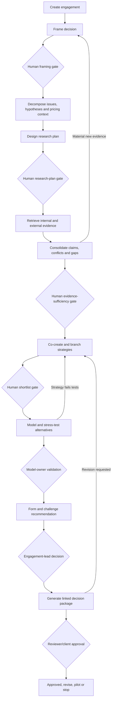

# Product requirements document: Pricing Strategy Workbench

**Document status:** Draft for discovery and build planning  
**Product status:** Pre-validation  
**Working title:** Pricing Strategy Workbench (PSW)  
**Version:** 0.1  
**Last updated:** 2026-07-11  
**Primary owner:** Product  
**Related documents:** [Product strategy](PRODUCT_STRATEGY.md) · [Evidence system](EVIDENCE_SYSTEM.md) · [Workflow and oversight](WORKFLOW_AND_OVERSIGHT.md) · [Architecture](ARCHITECTURE.md) · [MVP validation](MVP_VALIDATION.md)

## 1. Executive summary

Pricing Strategy Workbench is a human-led system for producing defensible pricing strategies from ambiguous client problems and fragmented evidence. It supports the work from decision framing through research, strategy creation, reproducible comparison and approval-ready asset generation. Financial arithmetic is deterministic; any statistical, causal, forecasting, optimisation or simulation method requires its own validation.

The product's core value is not generating a price or finding a margin anomaly. It is maintaining a traceable relationship between:

- What the client needs to decide
- What research was required and retrieved
- Which facts, disagreements and gaps were accepted
- How humans created and modified strategic alternatives
- Which model inputs and assumptions quantified them
- Why one conditional recommendation was selected
- Who reviewed and approved the client-facing assets

The initial target is boutique pricing and commercial-strategy consultancies working on non-routine, high-stakes pricing questions. Product-market fit is not yet proven; this PRD separates a synthetic hackathon demonstrator, a securely operated concierge design-partner pilot and a native product pilot.

The v0 engagement archetype is **new-offer monetisation under sparse historical data**. Other pricing problems remain research opportunities rather than initial coverage claims.

## 2. Problem statement

Pricing consultants must transform ambiguous commercial dilemmas into decisions using internal client information, market research, customer evidence, competitor intelligence, financial modelling and tacit expert knowledge. Today that reasoning is fragmented across documents, spreadsheets, general-purpose AI conversations and presentation files, making evidence difficult to consolidate, strategies difficult to challenge systematically, and outputs expensive to reconcile when evidence or assumptions change.

Without a connected system, teams risk producing generic strategies, losing contradictory evidence, introducing unsupported claims or numbers, repeating research, and circulating assets whose recommendation cannot be traced cleanly to source evidence and an approved model.

## 3. Product outcome

Enable an expert team to move from an ambiguous pricing brief to a **human-authored, evidence-grounded, model-tested and approval-ready decision package** while retaining meaningful control over research, strategy and recommendation.

## 4. Goals

### User goals

1. Produce decision quality that expert blind review judges at least non-inferior to the team's current process before counting any speed benefit.
2. Make 100% of material factual claims in an approved client asset traceable to reviewed evidence.
3. Make 100% of material quantitative claims in an approved client asset traceable to a versioned deterministic model output.
4. Allow consultants to originate, branch, edit, challenge and reject strategic alternatives rather than merely approve AI proposals; formal component-combine operations remain subject to interaction validation.
5. Allow a reviewer to understand the recommendation, contrary evidence, material assumptions and decision history without reconstructing the engagement from chat logs.

### Business goals

1. Demonstrate repeat usage across at least three engagements within one design-partner consultancy.
2. Secure at least one paid concierge pilot among five qualified design partners; track letters of intent and procurement steps separately as weaker signals.
3. Establish a differentiated upstream position from execution-oriented pricing platforms and generic AI productivity tools.
4. Build an evaluation corpus of expert-reviewed pricing cases and strategy outputs without commingling confidential client data.

Targets are hypotheses until baselines are obtained during design-partner discovery.

## 5. Non-goals

### MVP non-goals

1. **Live price setting or execution.** The system will not publish prices to commerce, ERP, CRM, CPQ or billing systems. This avoids entering a crowded, higher-risk operational category before the recommendation workflow is validated.
2. **Autonomous recommendations.** The system will not mark a strategy recommended or approved without an authorised human decision.
3. **Universal industry expertise.** The product will not claim validated agriculture, trading, healthcare, SaaS or retail methods in v1. It will expose evidence gaps and allow experts to provide relevant methods.
4. **High-frequency retail or market pricing.** SKU repricing, yield management, market making and algorithmic trading require specialised data and models outside this product.
5. **Automated legal or regulatory conclusions.** The system can flag review triggers and enforce workflow controls but cannot provide legal advice or certify compliance.
6. **Automatic primary customer research.** It may plan research and ingest approved transcripts or results; it will not recruit participants or represent unvalidated surveys as willingness-to-pay evidence.
7. **A full implementation-management suite.** The decision package may contain an implementation outline, but live rollout, training, KPI operations and execution integrations are later phases.

### Hackathon demonstrator non-goals

- Production authentication or enterprise tenancy
- Broad connectors beyond uploaded files and approved public web retrieval
- Real-time collaboration
- Multiple deterministic industry models
- Full policy-pack engine
- Pixel-perfect firm-specific branding

## 6. Target users and roles

### Engagement lead

Owns the client question, engagement scope, strategic judgment and final recommendation.

### Consultant / strategy author

Frames hypotheses, reviews evidence, creates and edits alternatives, owns narrative and coordinates client input.

### Researcher / analyst

Executes research plans, validates sources, prepares evidence, maps data and maintains assumptions.

### Model owner

Builds or configures the reproducible comparison, reconciles inputs and signs off calculations.

### Independent reviewer

Challenges evidence, strategy logic, model behaviour and client-facing claims.

### Client decision owner

Supplies organisational context, accepts commercial risk and approves or rejects the recommendation.

One person may hold multiple roles in a small firm, but the system records the role under which each material action was taken.

## 7. Jobs and user stories

### Engagement lead

- As an engagement lead, I want to turn a loose client memo into an explicit decision charter so that the team researches the correct question.
- As an engagement lead, I want to define non-negotiable constraints and evaluation criteria so that attractive but infeasible strategies are not presented.
- As an engagement lead, I want to originate or substantially change strategic alternatives so that the recommendation reflects professional judgment.
- As an engagement lead, I want to see why the proposed recommendation could be wrong so that I can challenge it before the client does.
- As an engagement lead, I want to approve one consistent decision package so that the memo, deck, model and appendix do not diverge.

### Researcher / analyst

- As a researcher, I want the system to convert diagnostic hypotheses into a reviewable retrieval plan so that research effort is decision-relevant.
- As a researcher, I want to search client documents and approved external sources while retaining exact provenance so that every claim remains auditable.
- As a researcher, I want duplicate, supporting and contradictory claims consolidated by question so that I synthesise evidence rather than summarise files.
- As a researcher, I want evidence gaps to remain visible so that absence of evidence is not converted into AI confidence.
- As an analyst, I want market and competitor prices normalised by currency, date, unit, package and inclusion where possible so that comparisons are not misleading.

### Strategy author

- As a strategy author, I want to create, branch, combine and edit strategy components so that the workspace supports genuine design rather than a rigid intervention menu.
- As a strategy author, I want each strategy component linked to supporting and contrary evidence so that I can see where the thesis is strong or speculative.
- As a strategy author, I want to ask for conservative, innovative, customer-led or implementation-led branches so that divergence is purposeful.
- As a strategy author, I want a rejection log so that discarded alternatives and reasons remain available during review.

### Model owner

- As a model owner, I want observations, derived values, external inputs and assumptions separated so that I can validate the calculation.
- As a model owner, I want each scenario linked to a strategy version so that narrative and economics cannot drift independently.
- As a model owner, I want the base case to reconcile with an approved baseline so that scenario deltas are meaningful.
- As a model owner, I want sensitivity and switching-value tests so that decision-makers understand which assumptions could reverse the recommendation.

### Reviewer and client decision owner

- As a reviewer, I want comments attached to evidence, assumptions, strategy components, model outputs and recommendation claims so that revision requests are precise.
- As a reviewer, I want to distinguish AI-generated, human-authored and calculated content so that responsibility is clear.
- As a client decision owner, I want a concise decision request with alternatives, economics, risks and conditions so that I can approve, revise, pilot or stop.
- As an authorised approver, I want approval to lock a version without preventing a new branch so that the audit trail remains intact.

## 8. Core product objects

The application operates on versioned objects, not an unstructured conversation history.

| Object | Purpose |
|---|---|
| Engagement | Client-isolated container for scope, people, policy context and artifacts |
| Decision charter | Approved problem, decision, objectives, boundaries, criteria and constraints |
| Context profile | Market mechanics, customers, competitors, company economics, organisation and implementation capability |
| Issue tree and method assessment | Initial hypotheses, issue decomposition, pricing-context diagnosis and human-approved research/method choices |
| Research question | Decision-linked question, hypothesis, source plan and sufficiency rule |
| Source | Document, dataset, webpage, transcript or note with provenance and permissions |
| Evidence claim | Atomic proposition extracted from a source with scope, limitations and review state |
| Evidence synthesis | Question-led view of support, contradiction, applicability and gaps |
| Analytical finding | Versioned analysis such as a value map, price waterfall or normalised comparison, with source inputs, method/formula, owner, uncertainty and limitations |
| Strategy | Branchable thesis composed of explicit design choices and dependencies |
| Assumption | Human-owned uncertain input with source, range, rationale and approval state |
| Model specification | Versioned mapping from strategy transformations and assumptions to formulas/methods, with deterministic financial arithmetic separated from other validated models |
| Scenario | Named set of approved assumptions and calculated outputs |
| Recommendation | Human-owned conditional choice, rationale, alternatives and decision request |
| Review decision | Comment, approval, rejection, override or requested revision with actor and timestamp |
| Artifact | Generated memo, deck, model or evidence book tied to an approved case version |

Detailed schemas are defined in [ARCHITECTURE.md](ARCHITECTURE.md).

## 9. End-to-end workflow

The workflow is controlled but non-linear. Exploratory strategy hypotheses may be created during decomposition and refined as evidence arrives. A user may return to an earlier stage without overwriting an approved version.

## 10. Delivery scopes and assurance levels

### D0 — Hackathon demonstrator

Synthetic data only. Demonstrate one thin proof loop:

- Curated brief and source set
- Question-led evidence synthesis that preserves one deliberate contradiction
- One human-authored strategy and one AI-assisted branch/challenge
- One case-specific deterministic financial model
- One review-ready HTML/PDF decision package with evidence/model appendices and model snapshot
- One changed assumption updating linked outputs consistently

Use one author and one reviewer. The terminal state is **ready for review**, not “client approved.” External search may be performed through an existing approved search capability, but building general web-retrieval infrastructure is outside D0.

### C1 — Concierge design-partner pilot

One selected engagement archetype, bounded public research and client uploads, operated using approved existing secure infrastructure plus documented manual controls. It includes a human-reviewed evidence map, human-led strategy canvas, one reviewed model and linked memo/deck/evidence outputs. Client stakeholders may review exported assets; native external-client collaboration is not required.

Real client data may be used only after security, data-processing, isolation, retention and legal gates in [GOVERNANCE_AND_COMPLIANCE.md](GOVERNANCE_AND_COMPLIANCE.md) are satisfied.

### P0 — Native product pilot

The requirements below describe the product-pilot system: authenticated users, server-enforced isolation, native workflow state, evidence lineage, modelling, artifacts and audit. They are **not** all hackathon requirements.

## 11. Functional requirements

### P0 — Must have for a native product pilot

For this PRD, a **material claim** is a factual or quantitative statement that could affect option design, option ordering, financial outcome, risk assessment, approval or external interpretation. The system may extract more granular claims internally, but human review focuses on consolidated findings plus material, disputed or high-risk claims. Every claim used in a final asset must be approved or clearly labelled as an assumption/assertion.

#### P0-01: Engagement and role setup

The user can create a client-isolated engagement, assign named roles, set jurisdiction and confidentiality labels, and record permitted data uses.

Acceptance criteria:

- Given a new engagement, when the lead completes setup, then the system stores client identity, authorised participants, jurisdiction, confidentiality and retention settings.
- Every product-pilot user has an authenticated identity, and role/engagement permissions are enforced server-side for read, edit, retrieval, export and approval actions.
- Confidential material from one client is not retrievable in another engagement.
- The system records who can draft, review and approve.
- Unauthorised direct-ID and cross-engagement access attempts are denied and logged.

#### P0-02: Decision charter and context profile

The system converts a brief and guided human input into an editable decision charter and context profile.

Acceptance criteria:

- The charter contains the decision, objective, scope, exclusions, time horizon, constraints, success measures, risk tolerance and owner.
- The context profile covers market, customer, competitor, company economics, ownership/capital priorities, culture, systems and implementation capability, with “unknown” permitted.
- The team can create an issue tree, initial hypotheses and exploratory option space before research; these are clearly unvalidated.
- A human-approved pricing-context assessment covers buyer/seller concentration, customer heterogeneity, offer differentiation, capacity/perishability, sales model, regulation and data availability, and explains which pricing/research methods appear applicable or inappropriate.
- No research may be marked approved until an authorised human approves the charter.
- AI-proposed content remains visibly proposed until accepted or edited.

#### P0-03: Research-plan generation and editing

The system proposes decision-linked research questions and a retrieval protocol that a researcher can modify and approve.

Acceptance criteria:

- Every research question identifies the decision or hypothesis it informs.
- Each question specifies source classes, inclusion/exclusion criteria, geography/date bounds, minimum sufficiency and reviewer.
- Questions are prioritised by decision impact, uncertainty, expected value of further evidence, time/effort budget and explicit stopping rule.
- Questions cover relevant market, customer, competitor, company and regulatory evidence; irrelevant categories may be marked not applicable with rationale.
- Where primary research is required, the system can draft a research request and interview guide for specialist approval, record the intended sample, and import approved transcripts/results; it does not recruit participants or call the method validated automatically.
- Retrieval does not begin automatically before human approval.

#### P0-04: Internal source ingestion

Users can add approved documents, spreadsheets, transcripts and notes to the engagement corpus.

Acceptance criteria:

- Supported inputs retain original filename, author/source where known, upload actor, date and confidentiality.
- The system reports unsupported, unreadable or incomplete files rather than silently omitting them.
- Extracted text remains linked to exact document location where the file format permits.
- Users can exclude a source from AI processing without deleting it from the record.

#### P0-05: Controlled public-web retrieval

Researchers can execute and refine searches against approved public sources from the research plan.

The product pilot integrates an approved search/retrieval provider; it does not build a general web crawler. Custom crawling and automated market feeds are P1/P2.

Acceptance criteria:

- Each search stores query, filters, time, operator and returned sources.
- Results preserve URL, page title, publication date where available and retrieval timestamp.
- The researcher can approve, reject or request deeper retrieval for each source.
- The system distinguishes public competitor information from client-supplied or confidential competitor information.
- Robots, access controls, copyright constraints and configured domain policies are respected.

#### P0-06: Claim extraction and provenance

The system extracts atomic claims from sources and retains enough provenance for a reviewer to inspect them.

Acceptance criteria:

- Every claim links to a source and exact location or supporting excerpt.
- Every claim stores source class, date, geography/segment applicability, retrieval time and extraction-quality/uncertainty metadata; this metadata must not imply factual reliability.
- Claims without adequate provenance cannot be approved for analysis.
- Paraphrases are visibly distinguished from short supporting excerpts.

#### P0-07: Evidence consolidation

The system consolidates evidence by research question rather than only summarising each source.

Acceptance criteria:

- Near-duplicate claims are clustered without deleting the original records.
- Supporting, contradicting and unrelated claims are separable.
- Applicability limitations and unresolved gaps remain visible.
- Market and competitor comparisons expose unit, currency, package and date mismatches.
- The system does not create a single confidence score that hides a material contradiction.

#### P0-08: Data quality, baseline and analytical findings

The system represents consultant analysis separately from raw source claims.

Acceptance criteria:

- Before quantitative strategy work, a diagnostic report covers completeness, customer/product master quality, currencies, units, time coverage, revenue/cost reconciliation, missing values and known biases.
- Client data is not treated as high quality merely because it is internal.
- An analytical finding records input source/version, method/code or formula, analyst owner, result, uncertainty, limitations and review state.
- Supported finding types may include segmentation, price waterfall, margin leakage, value map and normalised competitor comparison without hardcoding one mandatory methodology.
- Findings used in client-facing assets require human review and retain source/model lineage.

#### P0-09: Evidence review and sufficiency gate

Authorised humans can review claims and decide whether the evidence base is sufficient for strategy work.

Acceptance criteria:

- Source states and claim states are distinct as specified in [EVIDENCE_SYSTEM.md](EVIDENCE_SYSTEM.md).
- Users review consolidated findings and material, disputed or high-risk claims; they can accept, qualify, reject or request more research with rationale.
- Only evidence approved for analysis may be cited as support in a client-facing recommendation.
- The evidence gate shows unanswered questions, contradictory findings and explicit limitations.
- Conditional passage requires a named risk owner and documented limitation.

#### P0-10: Human-led Strategy Studio

Users can create strategies themselves and collaborate with AI to diverge, branch, combine, challenge and refine them.

Acceptance criteria:

- A human can start a blank strategy without accepting an AI suggestion.
- Each strategy starts with a human-authored or human-adopted thesis, value-creation/value-capture mechanism, causal chain, context fit, required conditions, failure modes and smallest credible test.
- Optional structure may cover target segment, offer/package, price metric, pricing/revenue model, price architecture, fences/terms, migration, governance and experiment design; it must not force field-first ideation.
- A user can create/edit one strategy, branch it and request a structured challenge without losing the original.
- AI suggestions identify evidence used, assumptions introduced and evidence gaps.
- The system records whether the thesis/rationale was human-originated, adopted, overridden or rejected; component-level version graphs and formal combine operations are P1 until the interaction is validated.
- A business-as-usual or “do not change pricing yet” option can be retained where relevant.

#### P0-11: Strategy-to-evidence linkage and shortlisting

Each strategic thesis and material component can be linked to supporting, contrary and missing evidence, then shortlisted against human-approved criteria.

Acceptance criteria:

- Unsupported components are labelled hypotheses, not facts.
- Humans define or approve critical success factors, hard constraints and evaluation criteria.
- Before detailed modelling, every shortlisted option receives indicative economics and a feasibility screen covering billing, contracts, capacity, channels, sales behaviour, systems, regulation and change effort.
- Hard-constraint failures are shown separately from weighted qualitative judgments.
- Rejected alternatives and rejection rationales remain in the decision log.
- The system cannot designate a preferred strategy without an authorised human action.

#### P0-12: Reproducible model layer and deterministic financial scenarios

The system executes a versioned reproducible model downstream of strategy creation, with deterministic financial arithmetic in the initial product.

Acceptance criteria:

- Observed data, derived values, external inputs and human assumptions are stored separately.
- Every behavioural assumption has an owner, rationale, source or “bounded expert assumption” label, and range where appropriate.
- A base case reconciles to an approved client baseline within a stated tolerance.
- The same inputs and model version reproduce the same outputs.
- Base, downside and upside scenarios are supported.
- Sensitivity or switching-value analysis identifies assumptions capable of changing option ordering or attractiveness.
- The language model does not perform authoritative arithmetic in free text.
- Deterministic arithmetic is distinguished from any statistical, causal, forecasting, optimisation or simulation model; such methods require separate validation, assumptions and reviewer competence.

#### P0-13: Recommendation and challenge workspace

The system assembles evidence and model results into an editable recommendation argument and produces a structured challenge.

Acceptance criteria:

- The recommendation contains decision, scope, rationale, supporting and contrary evidence, economics, assumptions, risks, rejected alternatives, conditions and requested approval.
- AI can draft and challenge but cannot own or approve the recommendation.
- At least one challenge view examines customer, competitor, finance, implementation and regulatory perspectives where applicable.
- The engagement lead may choose recommend, revise, research further, pilot only, maintain business as usual or stop.

#### P0-14: Linked decision-package generation

The system generates circulatable assets from one approved case version.

Required product-pilot assets:

1. Decision memo
2. Executive presentation
3. Deterministic model export or model snapshot
4. Evidence book / source appendix
5. Decision and review log
6. Pilot/implementation charter with target cohort, owners, operational changes, dependencies, communications, KPIs, guardrails, and stop/scale thresholds
7. Concise circulation note stating the exact review or approvals requested

Acceptance criteria:

- Assets are generated from a frozen case snapshot but remain drafts until package approval under P0-15.
- Each artifact shows engagement, version, status, generation time and approver state.
- Material factual claims include citations or footnotes resolvable to the evidence book.
- Material quantitative claims resolve to a scenario and model version.
- A consistency check blocks approval when the memo, deck and model disagree on a material number or recommendation.
- Regeneration after a changed assumption produces a new version without overwriting the approved package.

#### P0-15: Review, comments and approval

Reviewers can request revisions or approve a specific package version.

Acceptance criteria:

- Comments attach to evidence claims, assumptions, strategy components, model outputs or artifact sections.
- Workflow states include draft, internal review, client review, revisions requested, approved and superseded.
- Approval records actor, role, time, version and any conditions.
- Approval locks that version while allowing a new branch.
- No external-facing package can display “approved” without a named authorised approver.
- Material dissent and unresolved objections remain in the decision log with resolution status and the person accepting any non-legal residual risk.

#### P0-16: Audit, disclosure and content labels

The system records important AI, human and deterministic actions.

Acceptance criteria:

- The audit log records retrievals, material content generation, edits, approvals, overrides, model runs and artifact generation.
- Content can be inspected as retrieved fact, calculated result, human assumption, AI inference, human recommendation or generated narrative.
- Failed or low-confidence operations are visible and retryable.
- Audit events are tamper-evident, minimised, access-controlled and retained for a defined period. Where deletion is required, preserve only an appropriate tombstone/source hash rather than copied content, and flag historic assets whose evidence is no longer inspectable.

#### P0-17: Safety, confidentiality and competition controls

The MVP enforces minimum safeguards appropriate to AI-assisted pricing work.

Acceptance criteria:

- Client corpora and retrieval indexes are isolated.
- Users classify source origin, but all non-public rival information is quarantined by default; ordinary user attestation cannot clear it.
- Suspected competitively sensitive cross-rival information is unavailable to retrieval and recommendation generation until documented specialist review determines permitted handling.
- Personal data is minimised and handled under configured retention and deletion rules.
- Relevant legal-review triggers block final approval until a qualified reviewer determines the rule is inapplicable, confirms required controls, narrows/removes the conduct, or stops the engagement. Legal non-compliance cannot be accepted as residual business risk.
- The product does not use confidential client content to improve another client's outputs.
- Server-side tenant and engagement authorisation applies to the canonical database, object store, retrieval indexes, caches, telemetry/audit, exports, backups, model-provider calls and evaluation data.
- Before real-client ingestion, controller/processor roles, Article 28 terms where applicable, subprocessors, no-training/secondary-use settings, provider retention/deletion, security/breach assistance, data location and international-transfer mechanisms are documented and approved; otherwise use synthetic data only.

### P1 — Important after the core loop is validated

- Connectors for approved document stores, CRM, billing, ERP and research databases
- Interview-guide and survey-design assistance with specialist sign-off
- Firm-specific methodology templates and reusable research protocols
- Component-level strategy version graphs, formal combine operations and granular inline comments
- Configurable artifact branding and slide libraries
- Model adapters for common engagement archetypes
- Real-time collaborative editing and granular permissions
- Structured implementation roadmap and pricing playbook generation
- Export/handoff schema for execution platforms
- Policy packs by jurisdiction and sector
- Outcome monitoring and actual-versus-modelled learning

### P2 — Future considerations

- Validated industry-specific knowledge and model packs
- Client-facing workshop portal
- Advanced optimisation and causal modelling
- Automated primary-research operations
- Continuous market-signal monitoring
- Live price-execution integrations with separate authorisation architecture
- Privacy-preserving aggregate learning across engagements where legally and contractually permitted

## 12. Artifact requirements

### Decision memo

Pilot output formats: editable `.docx` plus reviewable `.pdf`. The hackathon may use a faithful HTML/PDF preview if office-file export is disclosed as simulated.

Must contain:

- Decision requested
- Situation and case for change
- Market/customer/competitor/company diagnosis
- Options considered
- Recommended course and scope
- Modelled outcomes
- Material assumptions and uncertainties
- Contrary evidence and risks
- Pilot or implementation outline
- Named approvals required

### Executive presentation

Pilot output formats: editable `.pptx` plus `.pdf` review copy. Slides must be generated from structured case objects rather than screenshots of a chatbot response.

Default template: six to eight slides, adaptable to the decision rather than a hard limit.

1. Decision and executive recommendation
2. Client objective and diagnosed problem
3. Evidence synthesis
4. Strategic alternatives
5. Quantified comparison and sensitivities
6. Recommendation, risks and conditions
7. Implementation/pilot outline
8. Decision request and approvals

### Deterministic model

Product-pilot output format: usable editable `.xlsx`, or an existing approved workbook plus validated input/output mapping. A static snapshot alone is insufficient. The model must expose inputs, assumptions, formulas/specification, scenarios, outputs, version and validation state. An exported spreadsheet must not contain unexplained hardcoded values inside formulas.

### Evidence book

Pilot output formats: `.pdf` plus structured `.xlsx`/`.csv` register where practical. It must include research protocol, source register, claim register, evidence syntheses, contradictions, gaps, limitations and citation identifiers.

## 13. AI quality and evaluation requirements

The system must be evaluated at the task and workflow level, not by subjective fluency.

Minimum test categories:

- Retrieval relevance and coverage against expert-created source sets
- Citation correctness and claim entailment
- Unsupported-claim rate
- Contradiction detection and preservation
- Strategy diversity and material distinctness
- Strategy-evidence alignment
- Model reproducibility and formula correctness
- Numerical consistency across artifacts
- Human-edit preservation
- Prompt-injection and malicious-document resistance
- Client-isolation tests
- Regulatory-trigger recall on curated cases
- Expert review of usefulness, novelty, defensibility and implementation realism

See [MVP_VALIDATION.md](MVP_VALIDATION.md) for proposed thresholds and test design.

## 14. Success metrics

### Leading indicators

| Metric | Pilot success threshold | Measurement |
|---|---:|---|
| Blinded decision quality | At least non-inferior to current-process package under a pre-calibrated expert rubric; quality gate must pass before speed is credited | Independent blind review |
| Voluntary workflow reuse | At least 3 of 5 target practitioners choose the structured workflow for a second case without being required | Observed follow-on choice |
| Reviewer issue-finding | Reviewers locate evidence/assumption/model issues at least as reliably and with less reconstruction effort than current materials | Comparative moderated review |
| Assumption-change consistency | 0 material discrepancies after one approved assumption changes linked outputs | Automated and human check |
| Provenance completeness | 100% of material factual claims in approved assets resolve to reviewed evidence | Automated check plus reviewer sample |
| Numerical lineage | 100% of material quantitative claims resolve to approved model output | Automated consistency check |
| Unsupported material claims | 0 in approved packages | Independent review |
| Meaningful human control | Users can originate, override and reject strategies in every test; expert median control rating at least 4/5 | Version history plus post-task rationale |
| Critical contradiction visibility | 100% of expert-seeded critical contradictions remain visible at evidence gate | Benchmark cases |
| Expert usefulness | Median at least 4/5 among target practitioners | Post-task survey with qualitative rationale |
| Time by stage | Measured against a documented comparable baseline, but treated as diagnostic until the quality gate passes | Time study |

### Lagging indicators

| Metric | Initial target |
|---|---:|
| Repeat engagement usage | At least three engagements in one design-partner firm within 90 days |
| Real engagement commitment | At least one firm commits an upcoming qualifying engagement to the concierge workflow |
| Paid validation | At least one qualified firm pays for a concierge pilot; LOIs and procurement conversations are tracked separately as weaker signals |
| Recommendation rework | Establish baseline first; target is fewer inconsistencies and review loops without lower blind-review quality |
| Trust retention | No decline in expert confidence after seeing full evidence and model lineage |
| Security/compliance incidents | Zero material cross-client, privacy or approval-boundary incidents |

## 15. Risks and mitigations

| Risk | Consequence | Mitigation |
|---|---|---|
| Product becomes a generic AI wrapper | Weak differentiation and fast incumbent replication | Build around structured lineage, evidence review, strategy objects and expert evaluation |
| Research volume creates false authority | Polished but invalid recommendations | Question-led protocol, source hierarchy, applicability review and visible gaps |
| Consultants bypass structured workflow | System adds friction without adoption | Test stage value, allow controlled shortcuts, make assets and review depend on canonical objects |
| Model cannot cover diverse engagements | Quantification becomes superficial | Use explicit model contract, bounded base model and reviewed adapters rather than claiming universal optimisation |
| Strategy Studio becomes a rigid template | Human creativity moves outside product | Blank-start, free composition, branch/combine operations and component-level authorship |
| Confidential competitor data leaks across clients | Legal and reputational harm | Tenant isolation, source classification, quarantine, audit and no cross-client retrieval |
| Generated assets appear authoritative before review | Client harm and trust loss | Prominent draft labels, approval gates and content-type disclosure |
| Incumbent pricing platforms move upstream | Wedge narrows | Remain vendor-neutral and focus on research-to-decision lineage and consultancy workflow |
| Evidence retrieval infringes rights or terms | Legal and operational exposure | Approved-source controls, access-respecting retrieval, limited excerpts and source metadata |

## 16. Phasing and timeline considerations

### Phase 0: hackathon demonstrator

Demonstrate one coherent engagement using a synthetic controlled case, curated public research sources, a small client corpus, one human-authored strategy plus one AI-assisted branch/challenge, one case-specific deterministic financial model and one linked review-ready decision pack.

### Phase 1: design-partner concierge pilot

Run real engagements with significant manual operations behind the interface. Validate workflow value, security expectations, model coverage and review behaviour before building connectors or reusable industry packs.

### Phase 2: pilotable product

Implement multi-user roles, stronger isolation, reusable methods, robust artifact generation, evaluation harnesses and selected connectors justified by pilot evidence.

### Phase 3: expansion

Add validated engagement or industry packs, implementation handoffs and learning loops only after repeat usage is demonstrated.

## 17. Dependencies

- Access to qualified pricing practitioners for discovery and expert evaluation
- Legally approved external search and retrieval capability
- Reliable document parsing with page/location retention
- A deterministic calculation runtime and export path
- Document, presentation and spreadsheet generation libraries
- Secure client-isolated storage and retrieval
- Approved model provider and data-processing terms
- Legal review of competition, privacy, consumer and intellectual-property controls

## 18. Open questions

### Blocking before pilot build

- **Product/model:** Which exact new-offer monetisation case and economic contract will anchor the demonstrator within the selected archetype?
- **User research:** Which stages currently consume the most consultant time, and which are perceived as valuable professional judgment rather than waste?
- **Design:** Will experts use a structured Strategy Studio, or must the initial interface resemble familiar documents and slides?
- **Engineering:** Can exact source-location provenance be preserved reliably for the initial file formats?
- **Data/model:** What is the smallest model contract that remains useful across the chosen engagement archetype?
- **Security/legal:** What hosting, retention, model-training and subcontractor terms will design partners require?
- **Legal:** Which jurisdictions and client types should be prohibited from the initial pilot?

### Non-blocking during prototype

- **Product:** Should external client reviewers enter the product or comment on exported assets?
- **Design:** How should authorship be displayed without cluttering the strategy experience?
- **Research:** What sufficiency rubric is acceptable across qualitative and quantitative evidence?
- **Commercial:** Seat-plus-engagement pricing or workspace licensing?
- **Engineering:** Which downstream handoff format offers value before native integrations?

## 19. Research basis and limitations

The product direction is supported by current pricing-practice guidance, official governance sources and first-party competitor descriptions documented in [RESEARCH_SOURCES.md](RESEARCH_SOURCES.md). Vendor and consultancy claims are directional market evidence, not independent proof of customer demand or product performance.

This PRD intentionally treats product-market fit, willingness to pay and quantified productivity improvement as hypotheses requiring design-partner validation.
